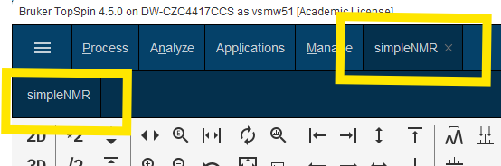

# simpleNMRbrukerTools

A set of Python tools to use simpleNMR under Bruker NMR TopSpin (>= 4.5.0).

## Prerequisites

Before installing simpleNMRbrukerTools, ensure you have:

- **Python 3** installed for TopSpin 4.5.0
- **Bruker-TopSpin Python libraries* installed (follow the Bruker Python 3 API inJupyter notebook PDF)
- Access to the Bruker/TopSpin Python3 environment


## Installation

### 1. Download the Repository

1. **Open a terminal** and activate the Bruker/TopSpin Python3 environment

2. Clone or download the `simpleNMRbrukerTools` repository from GitHub by copying the command below and running it in the the terminal window at a suitable directory location  on your hardrive:

```bash
git clone https://github.com/EricHughesABC/simpleNMRbrukerTools.git
```

### 2. Install the Package into the Topspin Python 3 site-packages folder

1. Again, if not already dons so, **Open a terminal** and activate the Bruker/TopSpin Python3 environment
2. **Navigate** to the `simpleNMRbrukerTools/simpleNMRbrukerTools` folder:
   ```bash
   cd simpleNMRbrukerTools/simpleNMRbrukerTools
   ```
3. **Install** using pip:
   ```bash
   pip install .
   ```

### 3. Setup TopSpin Integration

1. **Ensure TopSpin is running**
2. **Run the topspin setup command** in your terminal:
   ```bash
   setup-topspin
   ```

This installs the main program into the Python 3 Topspin user directory and installs the TopSpin flowbar integration files.

## TopSpin Flowbar Configuration

### Add simpleNMR Tab to Flowbar

1. **Right-click** on the TopSpin flowbar menu to add an new tab:

   

2. **Fill in the empty dialog** that appears:

   

3. **Complete the dialog** with the required parameters and click **OK**:

   

4. Topspin may need to be restarted to complete the installation.

### Verification

After successful configuration, you should see:

- The new **simpleNMR menu item** in the Flowbar menu system
- A **button to start simpleNMR** directly from TopSpin




## Example Data Set

In the top level directory of the repository there is a peak-picked dataset that can be used to test the simpleNMR installation

`BrukerSimpleNMR_ExampleData.zip`

Unzip the file and open one of the datasets in the directory into Topspin before clicking on the simpleNMR menu.


## Troubleshooting

### Common Issues

- **Installation fails**: Verify you're using the correct Bruker/TopSpin Python3 environment
- **setup-topspin command not found**: Ensure the package installed correctly with `pip list | grep simpleNMRbrukerTools`
- **Flowbar integration not working**: Make sure TopSpin is running before executing `setup-topspin`

## Support

For issues and questions:
- Check the [Issues](https://github.com/EricHughesABC/simpleNMRbrukerTools/issues) page
- Refer to the Bruker Python3/Jupyter tutorial documentation
- Send an email to simpleNMR@gmail.com for direct assistance

## License

This project falls under the MIT license.

## Contributing

If you are interested in helping please get in touch. Fork the project and submit an update. If you have comments or suggestions get in touch via email simpleNMR@gmail.com


