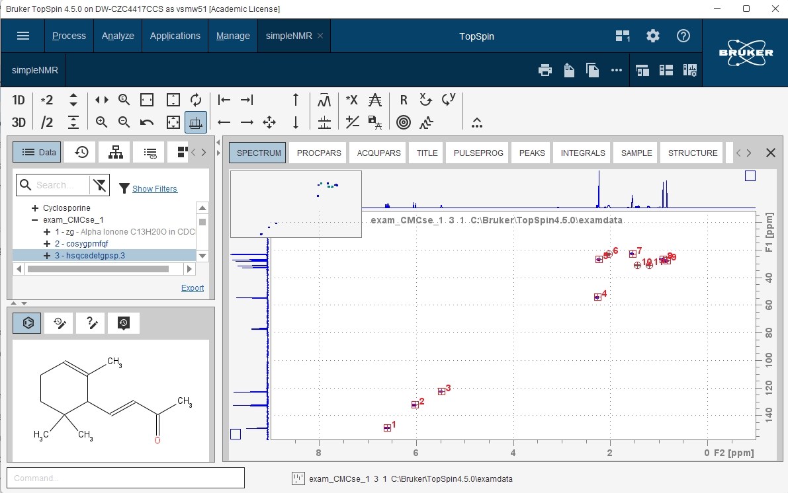
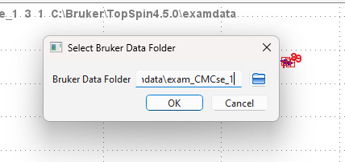

# Running simpleNMR in TopSpin

## Overview

simpleNMRbrukerTools integrates simpleNMR analysis directly into Bruker TopSpin, providing automated NMR structure verification capabilities through an intuitive interface. Once installed, the tool appears as a menu item in TopSpin's flowbar for seamless workflow integration.

## Getting Started

### Installation Verification

After successful installation of simpleNMRbrukerTools, verify that the simpleNMR menu appears in TopSpin's flowbar interface:

**Figure 1:** simpleNMR menu integrated into TopSpin flowbar

## Prerequisites

### 1. Dataset Preparation

- **Open your dataset:** Navigate to a TopSpin directory containing both 1D and 2D NMR experiments of your target molecule
- **Structure file:** Ensure a `.mol` file of your molecule is saved in the top-level directory and is visible in TopSpin's molecule viewer

**Figure 2:** TopSpin workspace showing an open HSQC dataset with the target molecule displayed

### 2. Data Processing Requirements

#### Essential Spectra
The following experiments should be properly processed before analysis:

| Experiment | Requirements | Notes |
|------------|-------------|--------|
| **HSQC** | Peak picking + integration | **Required** - Must be multiplicity-edited |
| **HMBC** | Peak picking only | Optional but recommended |
| **COSY** | Peak picking only | Optional but recommended |
| **1D ¹³C** | Peak picking only | Optional - include if consistent referencing |

#### Additional Considerations
- **DEPT-135:** Required if HSQC is not multiplicity-edited
- **1D ¹H spectra:** Generally excluded from complex systems but useful for 2D peak centering
- **Pure shift data:** Best excluded from automated analysis

### 3. Data Quality Guidelines

> **⚠️ Important:** simpleNMRbrukerTools has fewer built-in data validation checks compared to other simpleNMR interfaces. Pay special attention to:
> - Peak count consistency across datasets
> - Proper chemical shift referencing
> - Integration accuracy in HSQC data

**Critical Steps:**
1. **Peak pick precisely** - Accuracy directly affects assignment quality
2. **Reference consistently** - Ensure all spectra use the same reference standard
3. **Integrate HSQC carefully** - Required for correct multiplicity assignment
4. **Verify peak counts** - Manually check that peak numbers match molecular expectations

## Running the Analysis

### Step 1: Launch simpleNMR

1. Open a processed dataset in TopSpin
2. Click the **simpleNMR** button in the flowbar menu
3. Wait patiently during initial startup (may take 30+ seconds on first use)

### Step 2: Select Data Directory

The directory selection dialog will automatically open to your current TopSpin dataset location:

**Figure 3:** Automatic directory selection dialog

- Click **OK** if the displayed directory is correct
- Use the folder icon to browse to a different directory if needed

### Step 3: Choose Experiments

Select which experiments to include in the analysis. Only datasets with existing peak lists will be displayed:

**Figure 4:** Experiment selection dialog showing available peak-picked datasets

**Tips:**
- Set unwanted experiments to **SKIP** to exclude them
- Include all relevant 2D experiments for best results
- Consider excluding 1D proton data in complex systems

### Step 4: Submit and Wait

- Click to submit your data for analysis
- **Processing time:** 30-45 seconds (no progress indicator available)
- Remain patient - the analysis is running remotely

## Results

Upon successful completion, results open automatically in your default web browser as an interactive HTML page:

**Figure 5:** Interactive simpleNMR results displayed in web browser

The results page provides:
- **Assignment proposals** with confidence scores
- **Interactive molecular structure** with clickable assignments
- **Spectral correlation tables** showing supporting evidence
- **Export options** for further analysis

## Troubleshooting

### Common Issues
- **Long startup times:** Normal on first use - TopSpin is initializing the Python environment
- **No experiments shown:** Verify that peak picking has been completed
- **Analysis fails:** Check that all required files are present and properly formatted
- **Browser doesn't open:** Results are saved locally - check TopSpin's output directory

### Best Practices
- Always verify peak picking quality before submission
- Use consistent chemical shift referencing across all experiments
- Include molecular structure file for optimal results
- Keep dataset organized in a single TopSpin directory

## Support

For technical issues or questions about simpleNMR analysis, consult:
- TopSpin documentation for peak picking procedures
- simpleNMR online resources for interpretation guidance
- Local NMR facility staff for spectroscopic advice