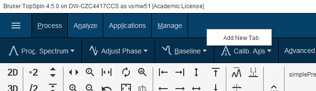
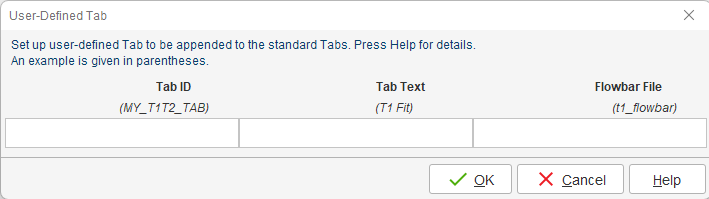
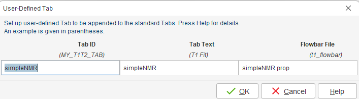
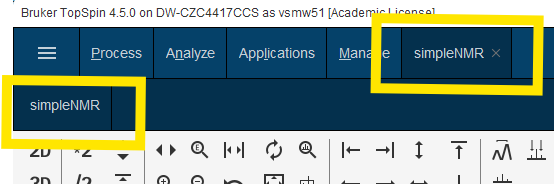

# simpleNMRbrukerTools

A set of Python tools to use simpleNMR under Bruker NMR TopSpin (>= 4.5.0).

## Prerequisites

Before installing simpleNMRbrukerTools, ensure you have:

- **Python 3** installed for TopSpin 4.5.0
- **Bruker-TopSpin Python utilities** installed (follow the Bruker Python3/Jupyter tutorial)
- Access to the Bruker/TopSpin Python3 environment

## Installation

### 1. Download the Repository

Clone or download the `simpleNMRbrukerTools` repository from GitHub:

```bash
git clone https://github.com/EricHughesABC/simpleNMRbrukerTools.git
```

### 2. Install the Package

1. **Open a terminal** and activate the Bruker/TopSpin Python3 environment
2. **Navigate** to the `simpleNMRbrukerTools` directory:
   ```bash
   cd simpleNMRbrukerTools
   ```
3. **Install** using pip:
   ```bash
   pip install simpleNMRbrukerTools
   ```

### 3. Setup TopSpin Integration

1. **Ensure TopSpin is running**
2. **Run the setup command** in your terminal:
   ```bash
   setup-topspin
   ```

This installs the main program into the Python 3 Topspin user directory and installs the TopSpin flowbar integration files.

## TopSpin Flowbar Configuration

### Add simpleNMR Tab to Flowbar

1. **Right-click** on the TopSpin flowbar menu:

   

2. **Fill in the dialog** that appears:

   

3. **Complete the dialog** with the required parameters and click **OK**:

   

### Verification

After successful configuration, you should see:

- The new **simpleNMR menu item** in the Flowbar menu system
- A **button to start simpleNMR** directly from TopSpin




## Example Bruker Data Set (already peak picked)

Due to GitHub's 100MB file size limit, the following files are hosted on Google Drive:

| File | Description | Size | Link |
|------|-------------|------|------|
| `exam_CMCse_1.zip` | Bruker Topspin dataset | 60MB | [Download](https://drive.google.com/uc?export=download&id=1Qdi8NzqOBgqj5Cu3x1Hpk71WnJpAtZz2) |


### Usage
```bash
# Download the files to your project directory
wget "https://drive.google.com/uc?export=download&id=1Qdi8NzqOBgqj5Cu3x1Hpk71WnJpAtZz2" -O exam_CMCse_1.zip
```


## Troubleshooting

### Common Issues

- **Installation fails**: Verify you're using the correct Bruker/TopSpin Python3 environment
- **setup-topspin command not found**: Ensure the package installed correctly with `pip list | grep simpleNMRbrukerTools`
- **Flowbar integration not working**: Make sure TopSpin is running before executing `setup-topspin`

## Support

For issues and questions:
- Check the [Issues](https://github.com/EricHughesABC/simpleNMRbrukerTools/issues) page
- Refer to the Bruker Python3/Jupyter tutorial documentation
- Send an email to simpleNMR@gmail.com for direct assistance

## License

This project falls under the MIT license.

## Contributing

If you are interested in helping please get in touch. Fork the project and submit an update. If you have comments or suggestions get in touch via email simpleNMR@gmail.com


